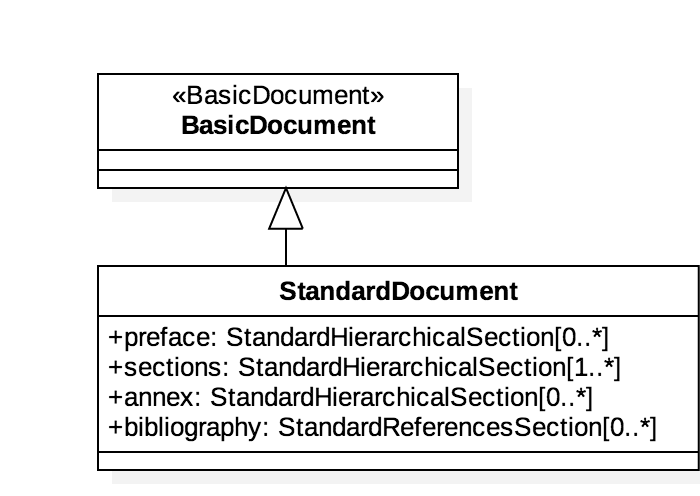

= StandardDocument Models

StandardDocument ("StanDoc") is a family of document models that forms the basis
of IsoDoc, which is used to represent ISO Standards and similarly structured
standards.

It is one of the document models that Selagraph operates on.

StandardDocument itself is a document model can form the basis of multiple
standard document types, including:

* https://github.com/riboseinc/isodoc[ISO Standards]
* https://github.com/riboseinc/csd[CSD Standards]
* https://github.com/riboseinc/gbdoc[Chinese Standards (GB and family)]

Bibliography UML models are located here:
https://github.com/riboseinc/bib-models[BibModels]

== Standard Document UML Models

=== StandardDocument

=== Sections

image::images/sections.png[]

=== Terms

image::images/terms.png[]

=== Data Types

image::images/datatypes.png[]
