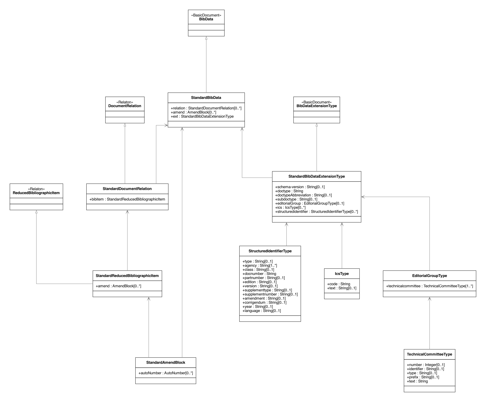
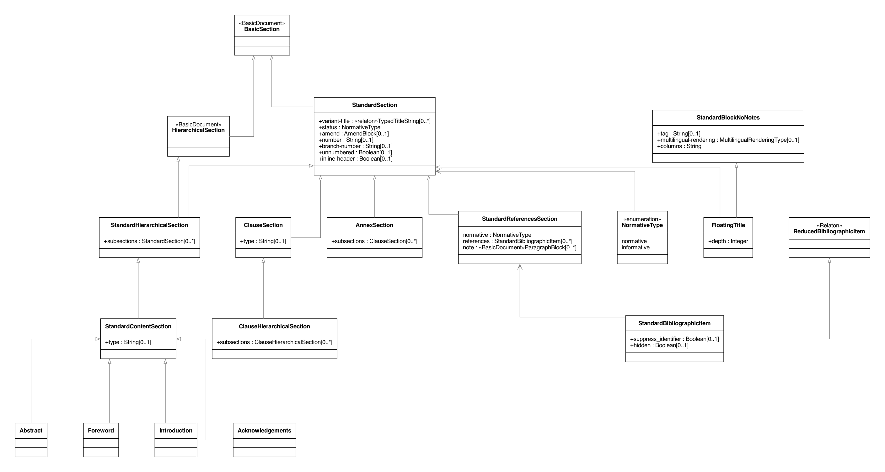
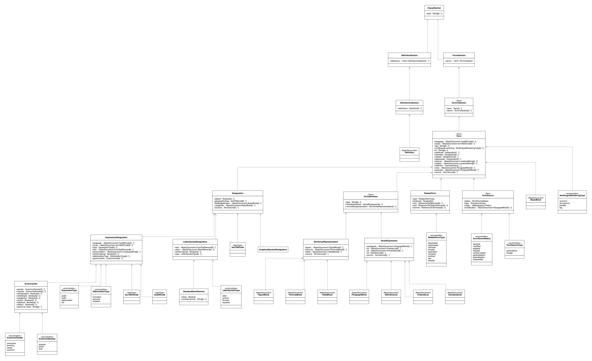
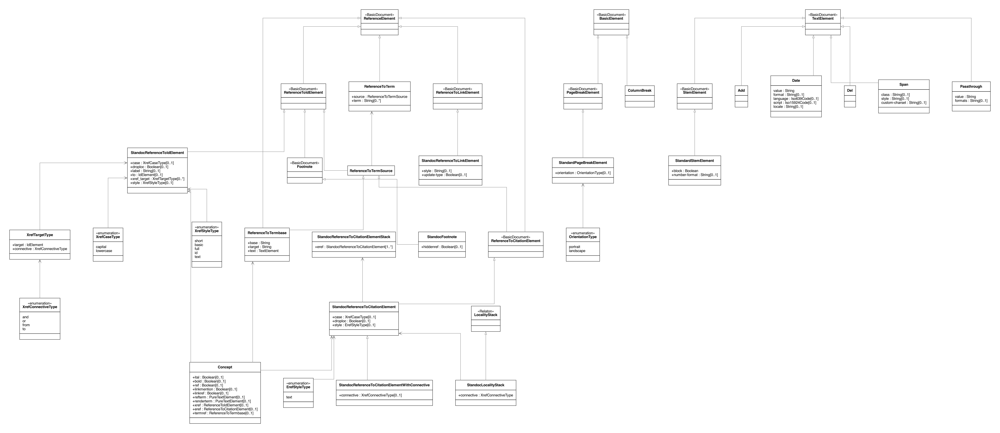

= Metanorma StandardDocument Models

image:https://github.com/metanorma/metanorma-model-standoc/workflows/make/badge.svg["Build Status", link="https://github.com/metanorma/metanorma-model-standoc/actions?query=workflow%3Amake"]

Metanorma `StandardDocument` (abbreviated as `StanDoc`)
is a family of document models that forms the basis
of Metanorma `IsoDoc`, which is used to represent ISO Standards and
similarly structured standards.
It itself is an instantiation of
https://github.com/metanorma/basicdoc-models[`BasicDocument` (`BasicDoc`)]

It is one of the document models that Selagraph operates on.

Metanorma StandardDocument itself is a document model can form the basis of multiple
standard document types, including:

* https://github.com/metanorma/metanorma-model-iso[ISO Standards]
* https://github.com/metanorma/metanorma-model-cc[CalConnect Standards]
* https://github.com/metanorma/metanorma-model-gb[Chinese Standards (GB and family)]

The Relaton Bibliography UML models used within these models are located here:
https://github.com/metanorma/relaton-models[Relaton BibModels]

== Standard Document UML Models

=== StandardDocument

image::images/StandardDoc_StandardDocument.png[]

=== Metadata

=== Sections

=== Terms

=== Blocks

image::images/StandardDoc_Blocks.png[]
image::images/StandardDoc_Blocks_New.png[]

=== Inline

