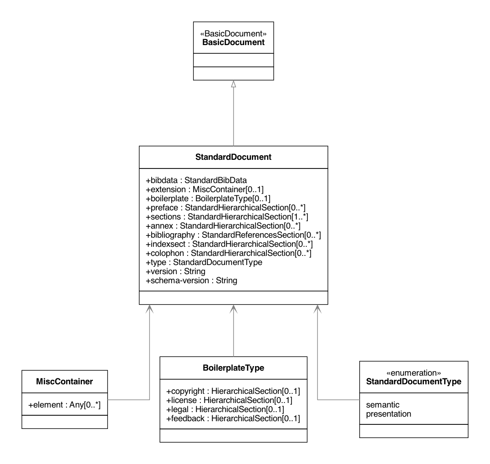
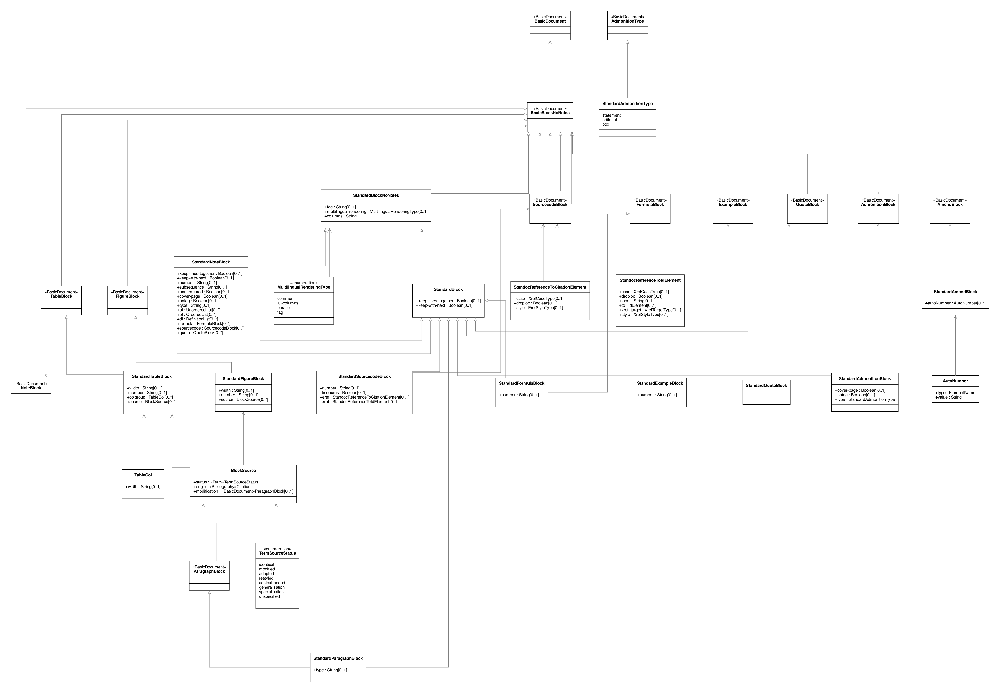
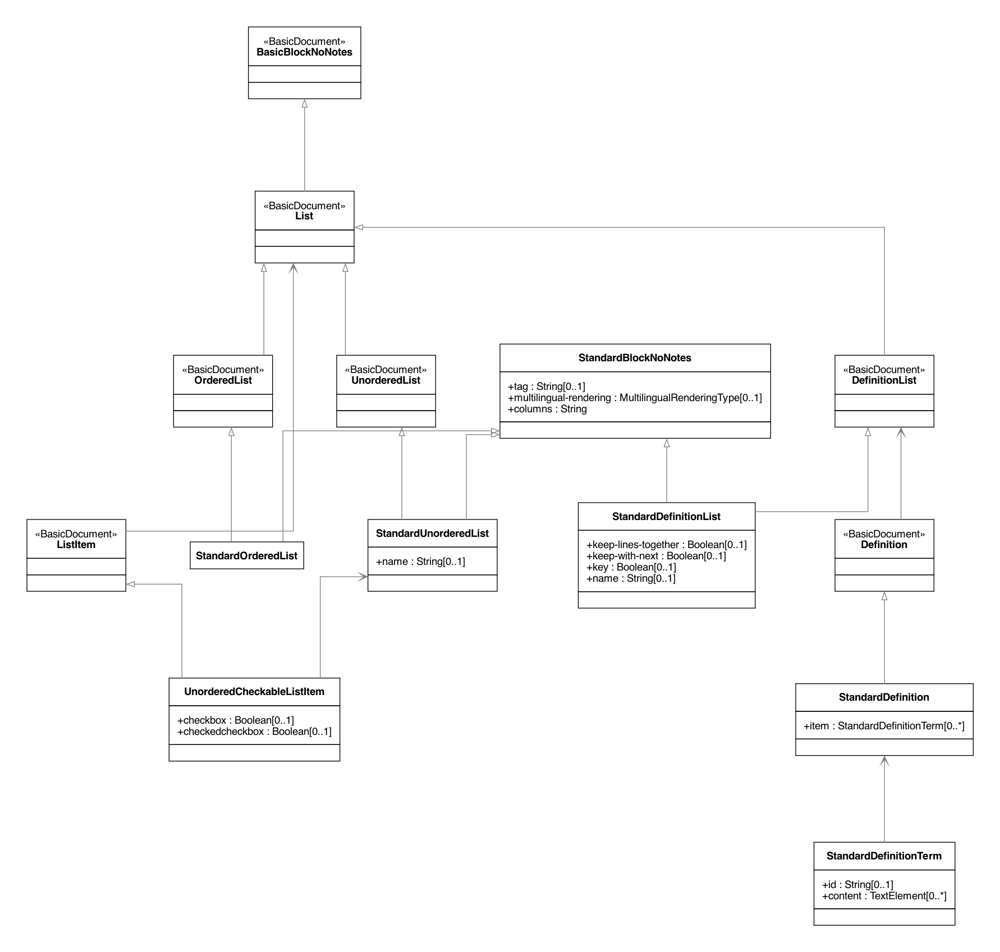
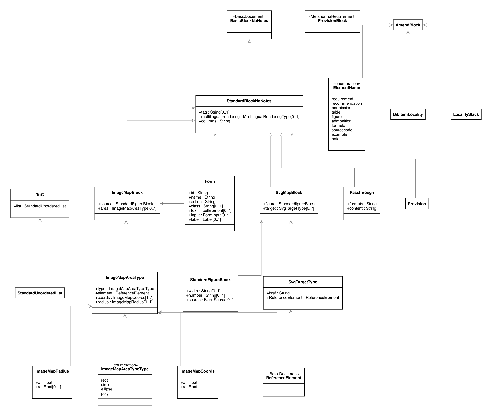

= Metanorma StandardDocument Models

image:https://github.com/metanorma/metanorma-model-standoc/workflows/make/badge.svg["Build Status", link="https://github.com/metanorma/metanorma-model-standoc/actions?query=workflow%3Amake"]

Metanorma `StandardDocument` (abbreviated as `StanDoc`) is a harmonized core
set of standardization document models that forms the basis for Metanorma
document models. It is an instantiation of
https://github.com/metanorma/basicdoc-models[`BasicDocument` (`BasicDoc`)]

NOTE: It is one of the document models that Selagraph operates on.

Metanorma StandardDocument is a document model can form the basis of multiple
standard document types, including deliverables from:

* https://github.com/metanorma/metanorma-model-iso[ISO and IEC]
* https://github.com/metanorma/metanorma-model-itu[ITU-T / ITU-D]
* https://github.com/metanorma/metanorma-model-ieee[IEEE SA]
* https://github.com/metanorma/metanorma-model-bipm[BIPM]
* https://github.com/metanorma/metanorma-model-ogc[OGC]
* https://github.com/metanorma/metanorma-model-iho[IHO]
* https://github.com/metanorma/metanorma-model-bsi[BSI]
* https://github.com/metanorma/metanorma-model-nist[NIST]
* https://github.com/metanorma/metanorma-model-csa[CSA]
* https://github.com/metanorma/metanorma-model-cc[CalConnect]
* https://github.com/metanorma/metanorma-model-m3aawg[M3AAWG]
* https://github.com/metanorma/metanorma-model-gb[GB and family]

The Relaton Bibliography UML models used within these models are located here:

* https://github.com/metanorma/relaton-models[Relaton BibModels]

== Standard Document UML Models

=== StandardDocument

=== Metadata

image::images/StandardDoc_Metadata.png[]

=== Sections

image::images/StandardDoc_Sections.png[]

=== Terms

image::images/StandardDoc_Terms.png[]

=== Blocks

=== Inline

image::images/StandardDoc_Inline.png[]

